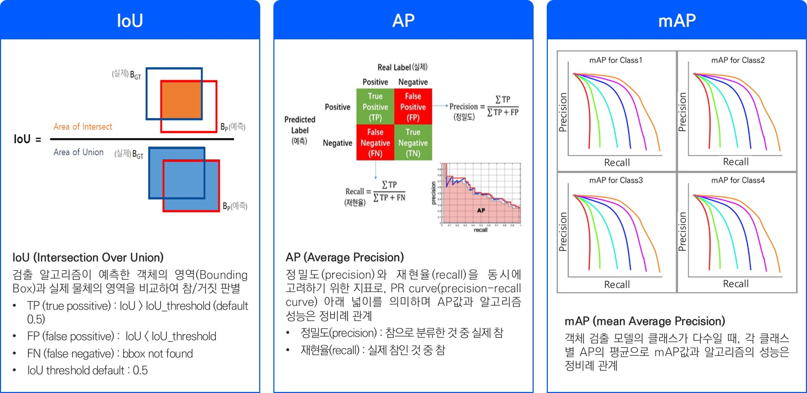

# Evaluation
-------------------------
## 0. Requirement
- absl-py
- numpy
- pandas
- nltk
## 1. bbox evaluation
**Quick start**
- python mAP.py -gt ./path_to_ground_truth -pred ./path_to_prediction
### 1.1 mAP

#### mAP 계산 주의사항
- score 기준 정렬후 높은 score 먼저 bbox 비교 실행
- iou가 가장높은 박스를 동시에 예측한경우 스코어가 가장 높은 예측만 tp (repeated match)
- iou 계산 시 양끝좌표 고려하여 + 1

## 2. ocr evaluation
**Quick start**
- python ocr_eval.py -gt ./path_to_ground_truth -pred ./path_to_prediction -wem
### 2.1 1-NED
### 2.2 WEM

